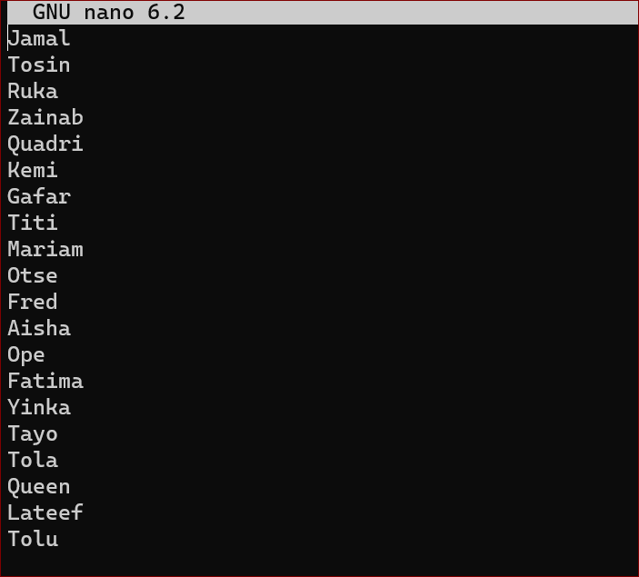
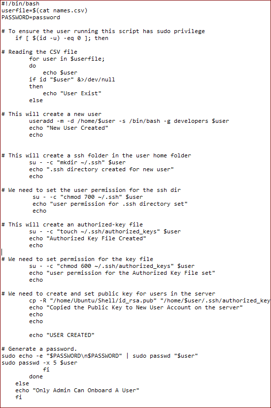
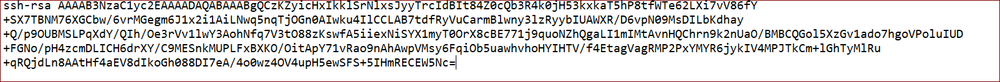
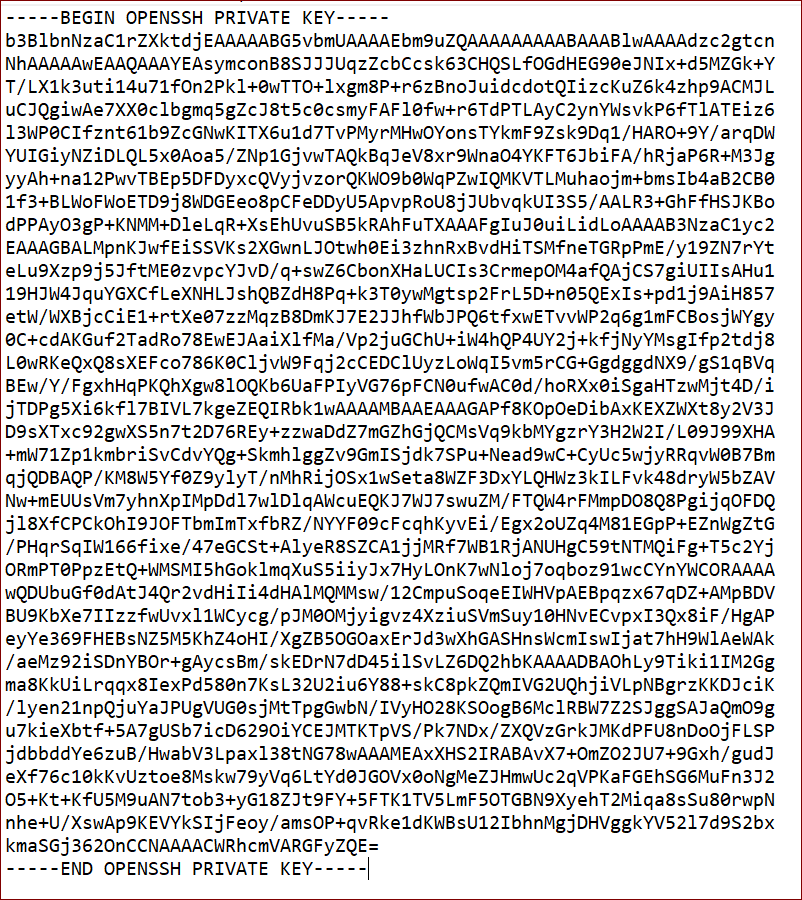
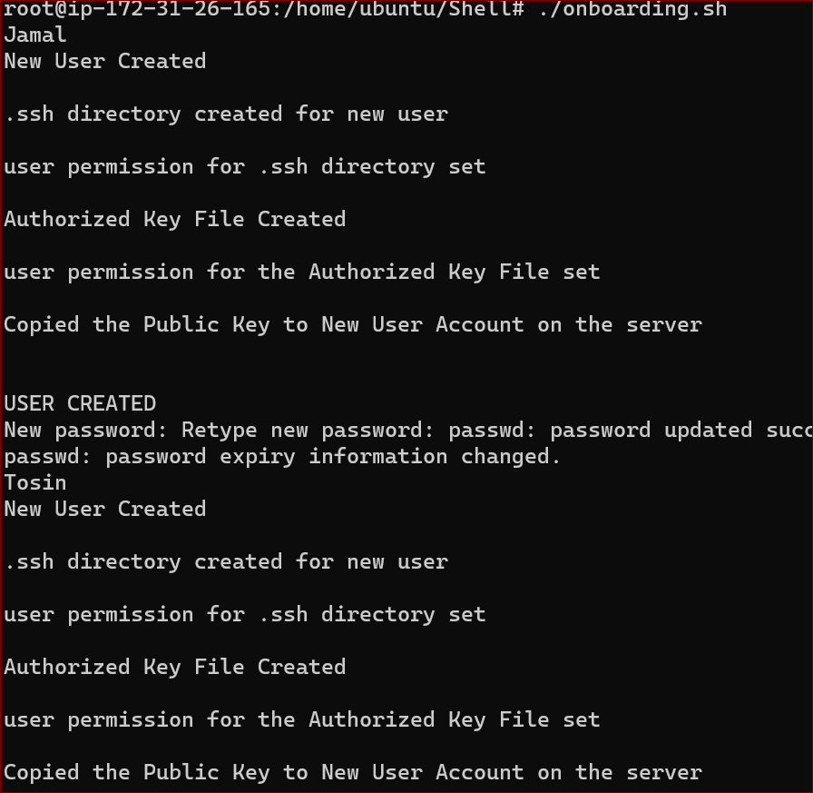
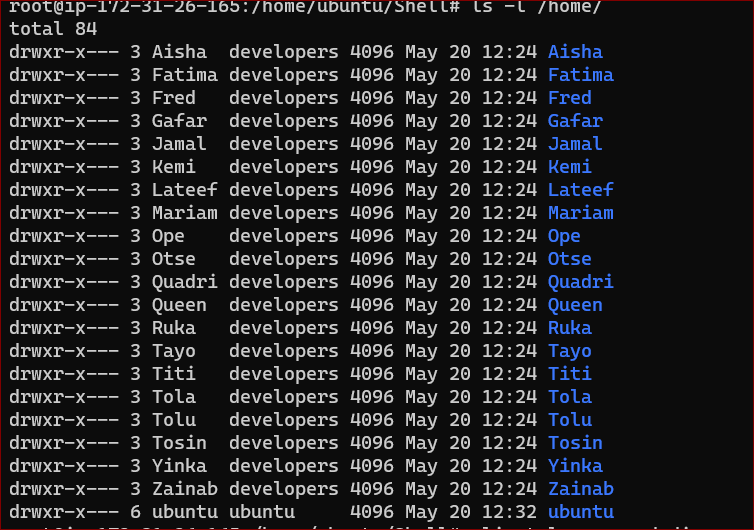
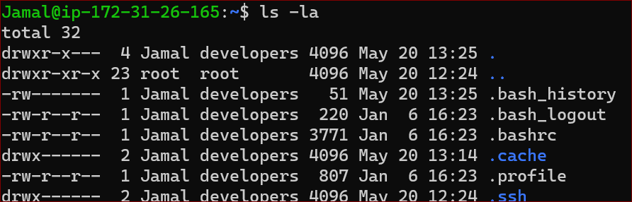

# AUX PROJECT 1- SHELL SCRIPTING

**.** The task of the project is to onboard 20 new Linux users onto a server.

**.** Connect to an EC2 instance on Ubuntu 22.0 server

**.** Create the project folder called Shell `mkdir Shell`

**.** Move into the Shell folder `cd Shell`

**.** Create a csv file named names.csv `touch names.csv` and open `nano names.csv`

**.** Insert 20 random names

**.** Create group called developers `sudo groupadd Developers`

**.** Create a shell script that reads the csv file we created that contains the names of the users to be onboarded.

**.** The script will create each user on the server and add to the group 'Developers'

**.** The script will first check for the existence of the user on the system, before attempting to create the user.

**.** The user that is being created also must have a default home folder.

**.** Each user should have .ssh folder within its home folder. if it does not exist , then it will be created.

**.** For each user's ssh configuration , we will create an authorized key file and add below the public key.

**.** Create a new file onboard.sh `vi onboarding.sh` and copy the script screenshot below into the file and save.

**.** Create two files `touch id_rsa`  `touch id_rsa.pub `

**.** In the id_rsa.pub file paste the public key

**.** In the id_rsa file paste the private key

**.** Make the onboarding.sh an executable file `sudo chmod +x onboarding.sh`.

**.** Switch to a super user `sudo su`, then run the script

**.** To confirm if all the users have been created type `ls -l /home/` in the Shell folder.

# To Connect with any of the users created 
**.**Create a file ruka.pem paste the public key, then run `ssh -i ruka.pem Jamal@54.234.158.65`, ensure the pem key is protected `sudo chmod 600 ruka.pem` 

